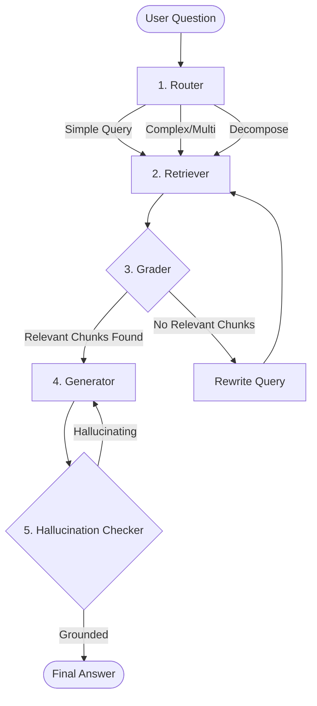

# 🛡️ Adaptive RAG Security Assistant

 
 
 


> A locally hosted, intelligent AI assistant designed specifically for cybersecurity professionals to analyze sensitive documentation without data leaving the machine.

---

## 🌟 Overview

The **Adaptive RAG Security Assistant** is a powerful Retrieval-Augmented Generation (RAG) system built to handle complex cybersecurity inquiries regarding internal policies, incident reports (like CVEs), and technical guides. By relying entirely on local infrastructure via Ollama and FAISS, it guarantees complete **GDPR compliance** and deep data privacy.

This project utilizes an advanced **Agentic AI architecture** powered by LangGraph, involving multiple discrete "nodes" (agents) to evaluate, retrieve, and fact-check responses, ensuring highly accurate and hallucination-free answers.

---

## 🔥 Key Features

- **100% Local Inference:** No cloud APIs. Models run locally via Ollama.
- **Agentic Routing (LangGraph):** The AI intelligently determines whether a question is simple, multi-part, or requires decomposition before searching.
- **Automated Hallucination Checking:** Every generated answer is rigorously verified against the source text before being presented to the user.
- **GDPR Compliant by Design:** Data is vectorized and stored locally using FAISS. Privacy is guaranteed.
- **Full-Stack Implementation:** Includes a modern, responsive Next.js frontend integrated with a fast, async FastAPI backend.
- **Citations Included:** Generated answers cite the specific page numbers from the uploaded PDFs.

---

## 🧠 Architecture Overview

The system processes questions through a 5-step LangGraph workflow to ensure the highest quality response.



*For more detailed technical information on the architecture, see [docs/ARCHITECTURE.md](docs/ARCHITECTURE.md).*

---

## 🛠️ Tech Stack

### Backend
- **Framework:** FastAPI
- **AI/LLM Routing:** LangGraph & LangChain
- **Vector Database:** FAISS
- **Running Locally:** Ollama (Llama 3.2, Nomic-Embed-Text)

### Frontend
- **Framework:** Next.js (React)
- **Styling:** CSS Modules / Vanilla
- **HTTP Client:** Axios

---

## 🚀 Getting Started

Follow these instructions to get the project running on your local machine.

### Prerequisites
1. **Python 3.11+**
2. **Node.js 18+**
3. **Ollama**: Must be installed and running locally on port `11434`.
4. Run the following to pull the required models:
   ```bash
   ollama pull llama3.2
   ollama pull nomic-embed-text
   ```

### 1. Start the Backend API

Open a terminal and navigate to your project folder:

```bash
cd backend

# Create and activate a virtual environment (Windows)
python -m venv venv
..\venv\Scripts\activate

# Install dependencies
pip install -r ../requirements.txt

# Start the FastAPI server
uvicorn main:app --reload --port 8000
```
*The backend will be running at `http://localhost:8000`*

### 2. Start the Frontend App

Open a second terminal and navigate to the frontend folder:

```bash
cd frontend

# Install dependencies
npm install

# Start the development server
npm run dev
# Note: Use `$env:NEXT_TELEMETRY_DISABLED="1"; npm run dev` to skip Next.js telemetry prompts on Windows.
```
*The frontend will be running at `http://localhost:3000`*

---

## 🎯 Usage

1. Open your browser and navigate to `http://localhost:3000`.
2. Upload a cybersecurity PDF document (e.g., a CVE report or policy document).
3. The system will ingest and vectorize the document locally into the `backend/indexes` folder.
4. Start asking complex questions about the document in the chat interface. You'll see the Agent strategy update in real-time as it routes, searches, and fact-checks.

---

## 📄 License
This project is open-source. Feel free to use and modify it for your specific security needs.
